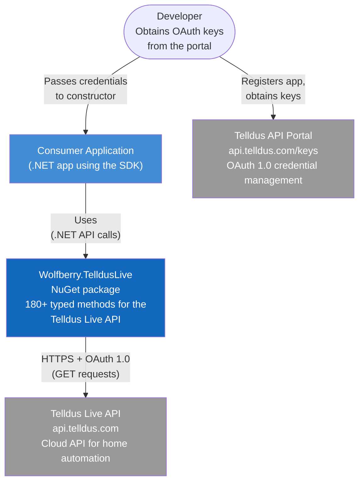
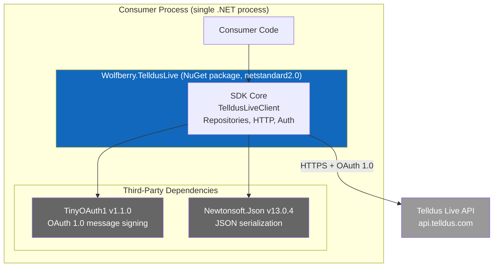
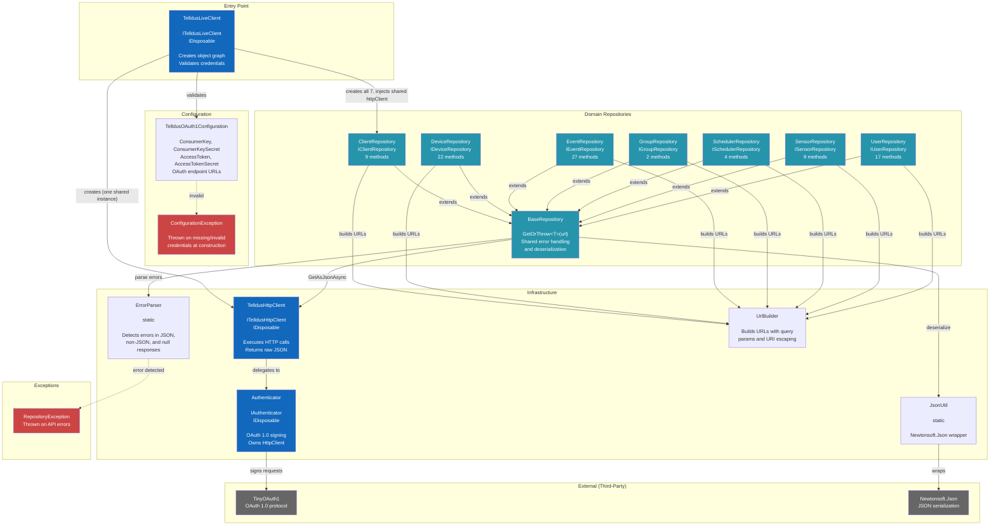
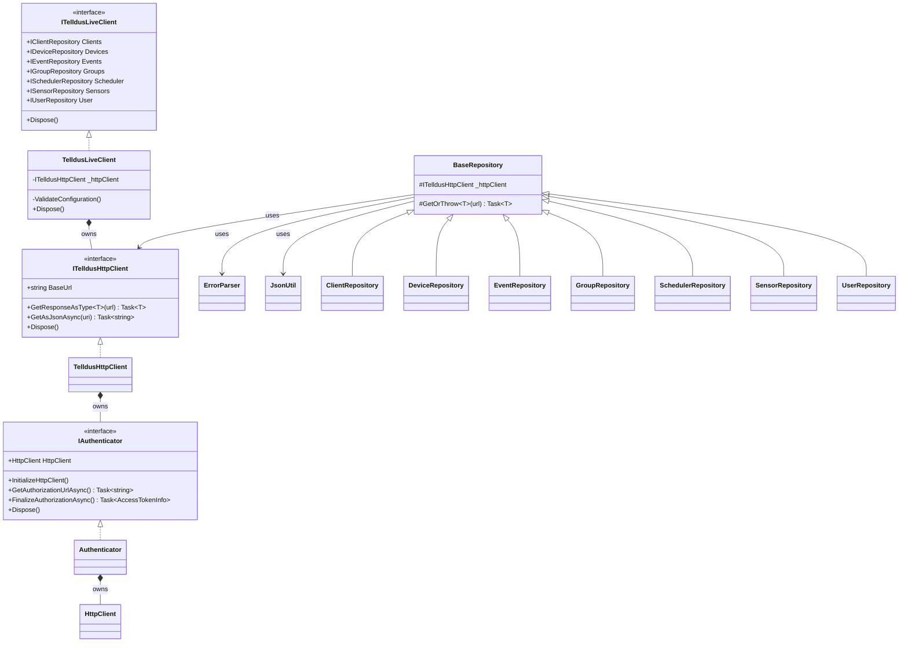
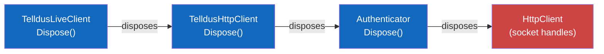
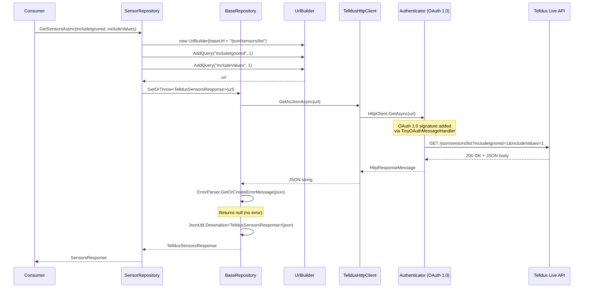
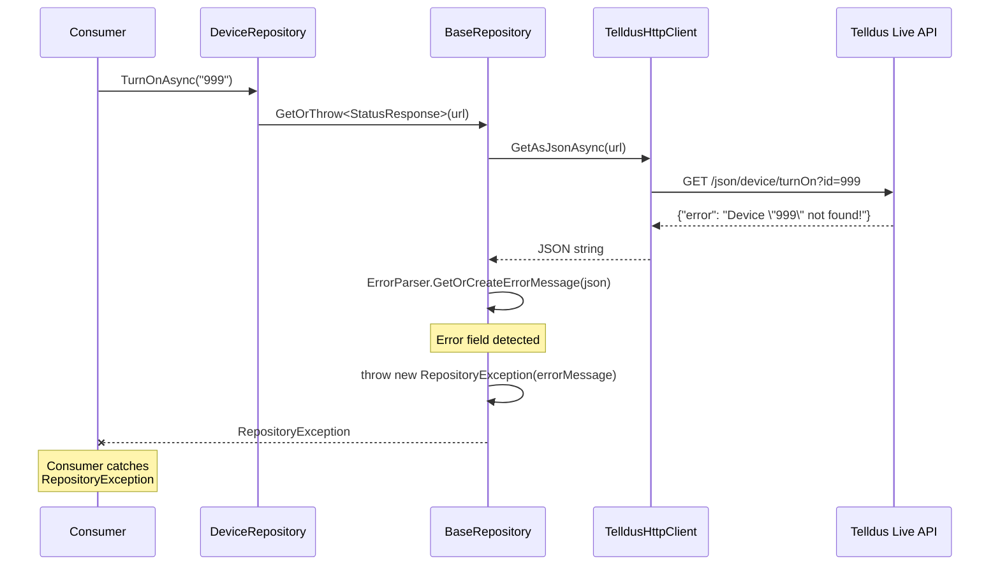

# C4 Architecture: Wolfberry.TelldusLive

> To view the Mermaid diagrams in this document, open it in [privmark.app](https://privmark.app) — a privacy-focused markdown viewer that renders Mermaid diagrams locally.

## Level 1: System Context

Shows the system, its users, and external dependencies.



## Level 2: Container

In C4 terms, a "container" is a separately deployable/runnable unit.
This SDK is a library — it runs **in-process** with the consumer.
There is only one container boundary to draw.



## Level 3: Component

Shows all components within the NuGet package and their relationships.



## Level 4: Code

### Interface hierarchy



### Disposal chain (ownership)



## Request Flow (Happy Path)



## Error Flow



## Telldus API Domain Mapping

Shows which repository maps to which Telldus Live API URL namespace.

```
Repository              API path prefix         Methods   Domain
--------------------    --------------------    -------   ---------------------------------
ClientRepository        /client/* /clients/*          9   Gateways/controllers (ZNet Lite)
DeviceRepository        /device/* /devices/*         22   Lights, switches, dimmers, blinds
EventRepository         /event/*  /events/*          27   Automation rules, triggers, actions
GroupRepository         /group/*                      2   Device groups (deprecated)
SchedulerRepository     /scheduler/*                  4   Scheduled jobs (time/sun-based)
SensorRepository        /sensor/* /sensors/*          9   Temperature, humidity, etc.
UserRepository          /user/*                      17   Profile, push tokens, EULA, auth
```
